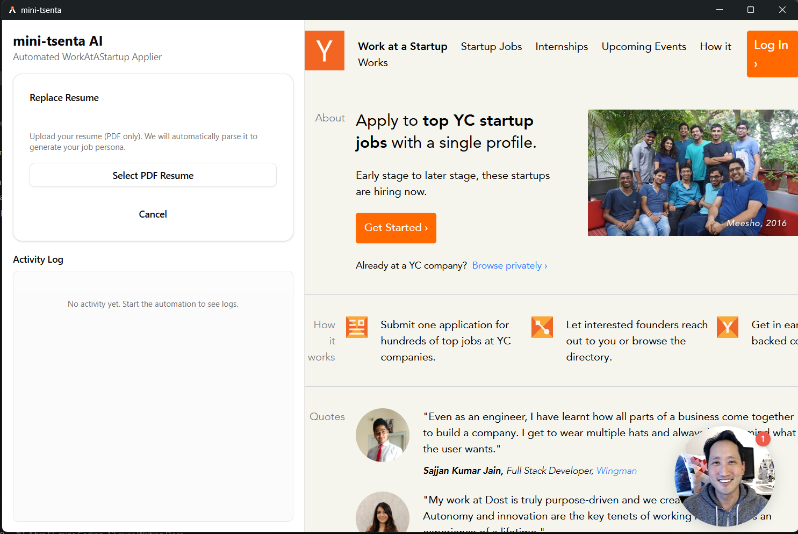
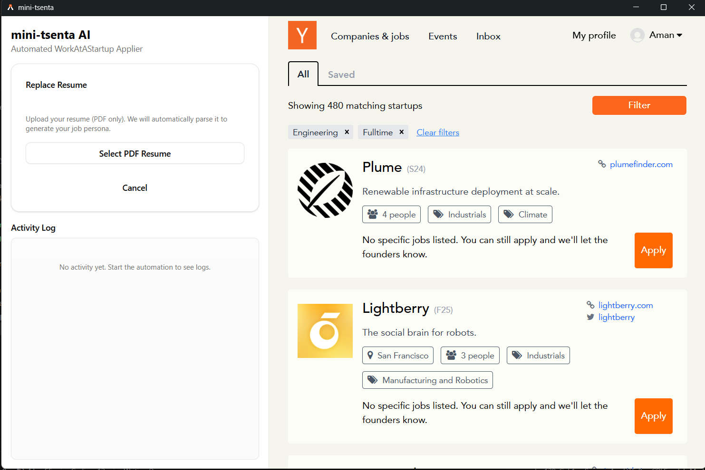
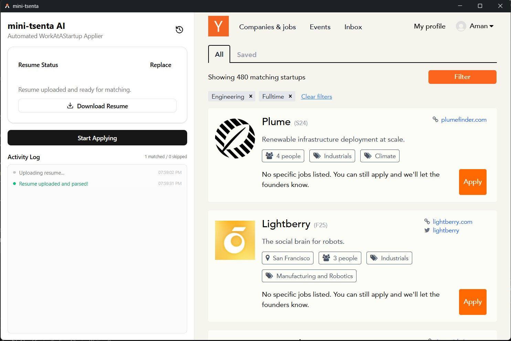
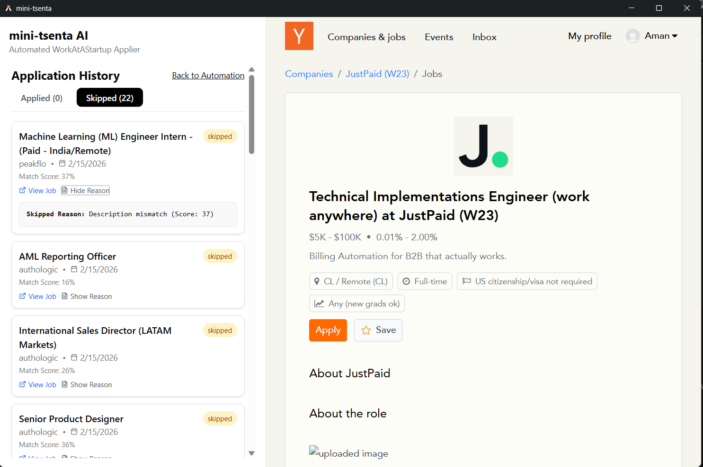
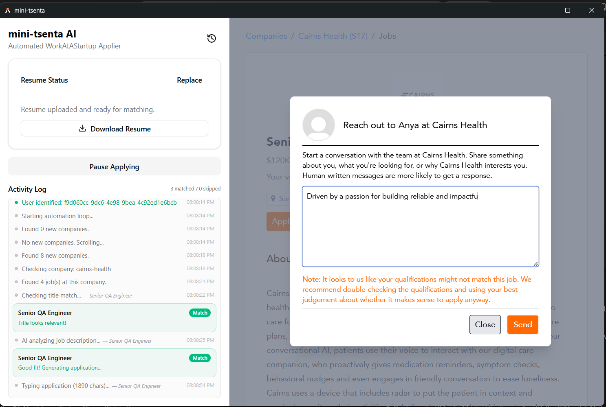
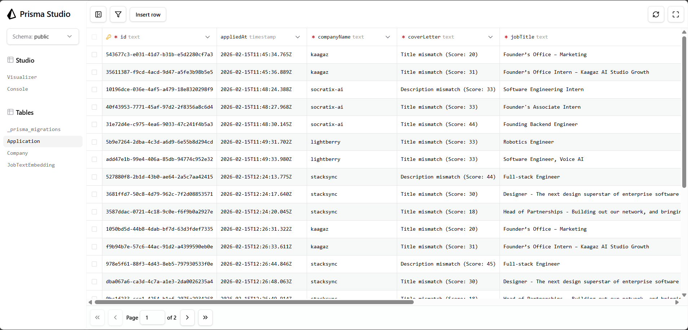

## 1) Features

1. **Resume setup in desktop app**
   - Upload a PDF resume.
   - Replace an existing resume.
   - Download the saved resume later.

2. **Resume processing pipeline**
   - The app parses PDF text.
   - AI generates a _target job persona_ from the resume.
   - AI creates an embedding from that persona.
   - The app saves profile data locally in Electron user data.

3. **Automation control**
   - Start automation.
   - Pause and continue automation.
   - Stop action closes automation and quits the app.

4. **Live split layout**
   - Left panel: React control UI.
   - Right panel: Live WorkAtAStartup browser view.

5. **User-specific tracking**
   - The app reads the logged-in user ID from WorkAtAStartup localStorage (PostHog key).
   - That ID is sent as `X-User-Id` so data is scoped per user.

6. **Company discovery and dedupe**
   - The app scans the companies list page.
   - Ignores non-company links.
   - Checks the API before saving, so duplicate companies aren't added for the same user.
   - Company visit is stored with a status.

7. **Job discovery per company**
   - The app opens each new company.
   - Finds all job links.
   - Handles navigation back to the list and keeps the scroll position.

8. **Two-stage AI relevance filter**
   - Stage 1: Title relevance check with embeddings.
   - Stage 2: Full description relevance check.
   - Similarity uses cosine score.
   - Embeddings for job text are cached in the DB by `model + textHash`.

9. **Skip handling and reasons**
   - If the title or description doesn't match, the app skips the job.
   - Skip reason and match score are stored in the applications table (`status: skipped`).
   - Duplicate job records are prevented per user + job URL.

10. **Application drafting (testing mode)**
    - If the job matches, the app opens the apply form.
    - AI generates a cover letter from the job description + original resume text.
    - The app types the cover letter into the textarea.
    - Saves the application to the DB with score and status.
    - Real submission is intentionally disabled (_filled, not submitted_).

11. **Already-applied detection**
    - If the page shows `Applied`, the job is skipped.

12. **Realtime activity log UI**
    - Logs info/success/error/skip/match events.
    - Shows job context and score bars.
    - Shows live matched/skipped counters.
    - Auto-scrolls to the newest log.

13. **Application history dashboard**
    - Open the history view.
    - Switch tabs: _Applied_ and _Skipped_.
    - View match score, date, and job link.
    - Expand each row to see the cover letter or skip reason.

14. **Backend API features**
    - Companies API: list, create, search by URL.
    - Applications API: list (latest first), create, search by job URL.
    - AI API: persona generation, embedding generation, relevance analysis, cover letter generation.
    - Proper bad request / unauthorized / not found / conflict handling for key cases.

15. **Data model features**
    - `Company` table with per-user unique URL.
    - `Application` table with per-user unique job URL and match score.
    - `JobTextEmbedding` table for reusable embedding cache.

## 2) How to run the app

1. Install dependencies from the repo root.
   - `pnpm install`

2. Create the env files.
   - Copy `apps/api/.env.example` to `apps/api/.env`
   - Copy `apps/desktop/.env.example` to `apps/desktop/.env`

3. Set the required env values.
   - In `apps/api/.env`: `DATABASE_URL`, `OLLAMA_MODEL_GENERATION`, `OLLAMA_MODEL_EMBEDDING` (other defaults are already in the example)
   - In `apps/desktop/.env`: `DATABASE_URL`, `OLLAMA_MODEL_GENERATION`, `OLLAMA_MODEL_EMBEDDING`

4. Make sure PostgreSQL is running.
   - Example with Docker: `docker run --name dockpost -e POSTGRES_USER=postgres -e POSTGRES_PASSWORD=Nothing1234 -e POSTGRES_DB=mini_tsenta -p 5432:5432 -d postgres`

5. Run DB migrations (from `apps/api`).
   - `npx prisma migrate dev`

6. Ensure Ollama is running and models are pulled.
   - `ollama pull gemma3:4b`
   - `ollama pull qwen3-embedding:0.6b`

7. Start everything from the repo root.
   - `pnpm run dev` _(API + Desktop together, recommended)_
   - Optional: `pnpm run dev:api` and `pnpm run dev:desktop` separately

## 3) Tech stack

- **Monorepo**
  - pnpm workspaces

- **Root package**
  - devDependencies: concurrently, prettier

- **API app (apps/api)**
  - framework/runtime: @adonisjs/core, @adonisjs/auth, @adonisjs/cors, @adonisjs/lucid, reflect-metadata
  - database: postgresql, pg, prisma, @prisma/client, @prisma/adapter-pg
  - AI: ollama
  - validation/date/env: @vinejs/vine, luxon, dotenv
  - devDependencies: @adonisjs/assembler, @adonisjs/eslint-config, @adonisjs/prettier-config, @adonisjs/tsconfig, @japa/api-client, @japa/assert, @japa/plugin-adonisjs, @japa/runner, @swc/core, @types/luxon, @types/node, @types/pg, eslint, hot-hook, pino-pretty, prettier, ts-node-maintained, typescript

- **Desktop app (apps/desktop)**
  - desktop/runtime: electron, electron-vite, electron-builder, @electron-toolkit/preload, @electron-toolkit/utils
  - frontend: react, react-dom, vite, @vitejs/plugin-react, typescript
  - UI/styling: tailwindcss, @tailwindcss/vite, radix-ui, class-variance-authority, clsx, tailwind-merge, tw-animate-css, lucide-react
  - state: @reduxjs/toolkit, react-redux
  - automation + parsing: playwright-core, pdf-parse, @types/pdf-parse
  - AI/env: ollama, dotenv, @heyputer/puter.js
  - devDependencies: @electron-toolkit/eslint-config-prettier, @electron-toolkit/eslint-config-ts, @electron-toolkit/tsconfig, @types/node, @types/react, @types/react-dom, eslint, eslint-plugin-react, eslint-plugin-react-hooks, eslint-plugin-react-refresh, prettier, ts-node

- **Infra + data + protocols**
  - database: PostgreSQL
  - local AI server: Ollama
  - browser automation connection: CDP (remote-debugging-port)
  - API style: REST JSON over HTTP

## 4) Screenshots

